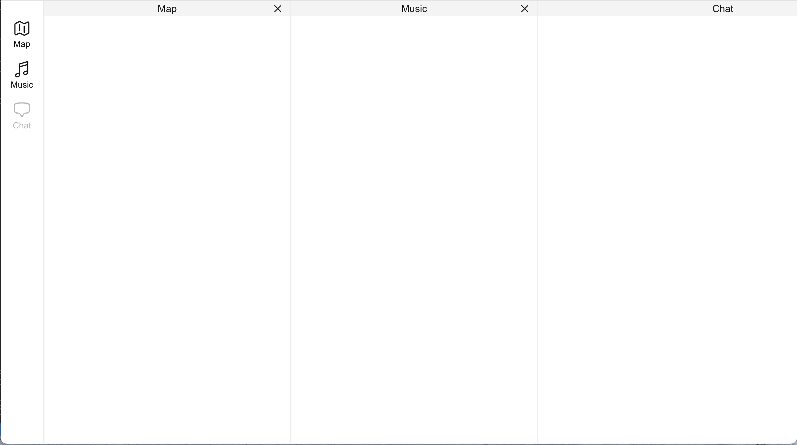

# 拖拽排序面板组件

基于 Next.js + Tailwind CSS + DNDKit 实现的水平拖拽排序面板组件。

## 效果图



## 开发说明

1. 使用 Next.js 框架 + Tailwind CSS
2. 右侧 3 面板在浏览器宽度小的时候可以左右滑动，左侧固定
3. 面板可以点击 × 关闭，关闭后左侧图标变成透明灰色，点击左侧按钮可以打开/关闭
4. 使用 DNDKit 开发，三个面板可以顶部左右拖动排序
5. 拖拽排序后左侧的图标同步排序，拖拽松手有平滑动画
6. 图标使用 Heroicons outline 样式

## 使用技术栈

- **框架**: Next.js 14 (App Router)
- **样式**: Tailwind CSS
- **拖拽**: @dnd-kit/core + @dnd-kit/sortable
- **图标**: @heroicons/react (outline)

## 使用图标

- MapIcon - 地图
- MusicalNoteIcon - 音乐
- ChatBubbleBottomCenterIcon - 聊天
- XMarkIcon - 关闭

## 快速开始

```bash
# 安装依赖
npm install

# 启动开发服务器
npm run dev

# 构建生产版本
npm run build

# 启动生产服务器
npm run start
```

## 项目结构

```
src/
├── app/
│   ├── globals.css      # 全局样式
│   ├── layout.tsx      # 根布局
│   └── page.tsx        # 主页面组件
├── components/
│   └── SortableItem.tsx # 可拖拽面板组件
└── types/
    └── index.ts         # TypeScript 类型定义
```

## 功能特性

- 左侧固定图标导航栏（可打开/关闭面板）
- 右侧水平面板布局，支持滚动
- DNDKit 拖拽排序
- 平滑动画过渡效果
- 响应式设计

## 操作说明

| 操作 | 描述 |
|------|------|
| 拖拽面板头部 | 调整面板顺序 |
| 点击 × 按钮 | 关闭当前面板 |
| 点击左侧图标 | 打开/关闭对应面板 |
